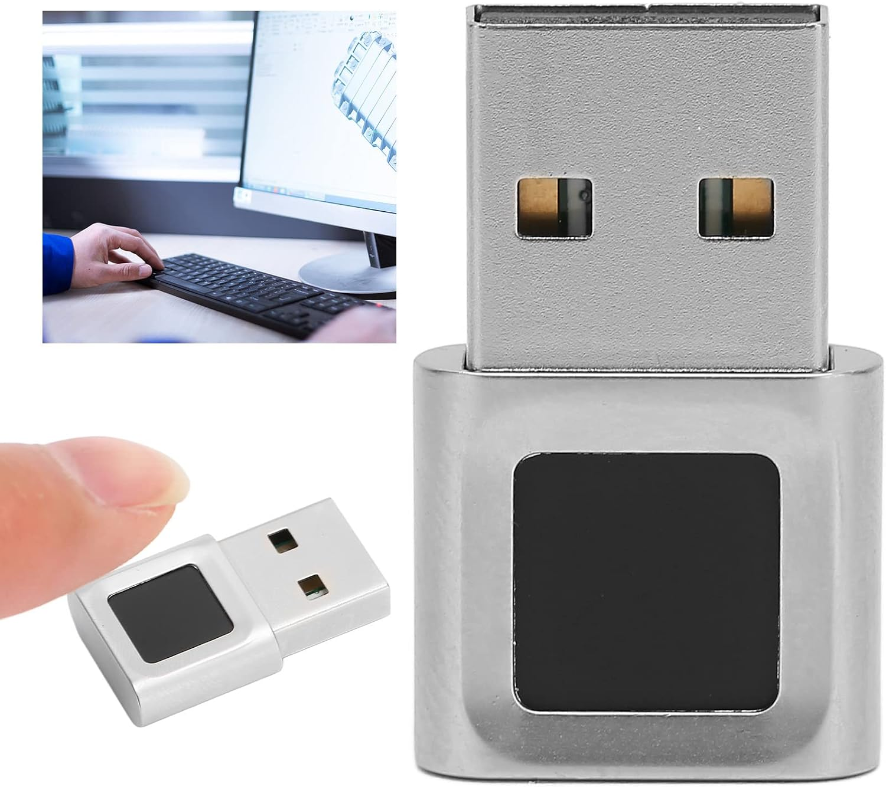

# ft9201-libfprint

Linux fingerprint support for the **Focal-systems FT9201** USB reader
(`2808:93a9`, sold as a standalone Windows Hello dongle), as a
[libfprint](https://gitlab.freedesktop.org/libfprint/libfprint) driver.

<p align="center">
  
</p>

The sensor is a tiny 96×96 optical reader. libfprint's built-in matcher does a
poor job on an image that small, so this driver instead reuses **FocalTech's own
matching engine** — the `ftWbioEngineAdapter.dll` from their signed Windows
driver — running it natively on Linux with a small in-process PE loader. No Wine,
no Windows, no cloud.

> **This repo is also a reusable method, not just one driver.** The technique —
> running a vendor's Windows matching engine natively on Linux, no Wine —
> generalizes to other "Windows Hello only" readers, **including ones that ship an
> SDCP secure channel** (the Synaptics/Goodix/ELAN/EgisTec-class crypto sensors),
> via the optional [`src/crypto_shims.c`](src/crypto_shims.c) module. The FT9201 is
> the worked example; the in-process loader, the WinBio bridge, and the
> crypto-bypass layer carry over to the next device. See **[PORTING.md](PORTING.md)**
> for the step-by-step method and what to reuse as-is.

## Status

Working end-to-end on real hardware: enroll and verify through `fprintd` /
command-line tools, and in KDE/GNOME once installed. It matches your finger
using the vendor's real algorithm.

Developed and tested against
[this exact reader](https://www.amazon.com/dp/B0DK7LQZGH) (ASIN `B0DK7LQZGH`) —
the FT9348W variant of `2808:93a9`.

Caveats:
- Tested only on that FT9348W variant of the `2808:93a9` device.
- The matcher is a proprietary blob we call into; we can't fix bugs inside it.
- x86-64 only (the DLL and loader are 64-bit).

## How it works (short version)

- The USB init + firmware-boot sequence was reverse-engineered from FocalTech's
  own drivers; the 8051 MCU firmware is uploaded, then a specific register-config
  sequence starts it.
- Each capture (96×96) is center-cropped to the 64×80 the engine expects.
- `ft_engine.c` is a ~450-line loader that maps `ftWbioEngineAdapter.dll` into
  memory, provides the ~90 `kernel32` functions it imports, sets up a fake
  Windows TEB, and calls the engine's WinBio interface for enroll/verify.
- The loader maps code read-execute and data read-write from an in-memory file,
  so **no page is ever writable *and* executable**. That means it runs under
  `fprintd`'s default `MemoryDenyWriteExecute` hardening — you do **not** have to
  disable any security settings.

See [`docs/how-it-works.md`](docs/how-it-works.md) for the full technical writeup.

## Requirements

Build tools + libfprint's build dependencies. On Fedora/Nobara:

```
sudo dnf install git meson ninja-build gcc cabextract python3 \
     glib2-devel gusb-devel nss-devel pixman-devel gobject-introspection-devel \
     libgudev-devel systemd-devel
```

(Debian/Ubuntu: the equivalents — `libglib2.0-dev libgusb-dev libnss3-dev
libpixman-1-dev libgudev-1.0-dev libsystemd-dev`, plus `cabextract`.)

## Build & install

```
git clone https://github.com/OMGrant/ft9201-libfprint
cd ft9201-libfprint
scripts/fetch-blobs.sh     # pull the vendor DLL + MCU firmware (see note below)
scripts/build.sh           # clone pinned libfprint, graft the driver in, build
```

Try it without installing anything:

```
FT9201_ENGINE_DLL=$PWD/blobs/ftWbioEngineAdapter.dll \
LD_LIBRARY_PATH=libfprint/build/libfprint \
libfprint/build/examples/enroll
```

Install it for KDE/GNOME/login (side-by-side; your distro's libfprint is left
alone, no hardening disabled):

```
sudo scripts/install.sh
fprintd-enroll
```

Undo everything: `sudo scripts/install.sh --uninstall`.

## The proprietary blobs

This repo contains **no** proprietary binaries. Two files are FocalTech's and are
fetched from existing public sources at build time by `scripts/fetch-blobs.sh`:

| File | What it is | Where it comes from |
|------|------------|---------------------|
| `ftWbioEngineAdapter.dll` | the matching engine | FocalTech's signed Windows driver on the Microsoft Update Catalog |
| FT9348W MCU firmware (`src/ft9201_fw.h`) | 8051 firmware the sensor runs | extracted (symbol `FOCALFP_9348_FW_APP`) from the public [`ft9201-static`](https://github.com/mrrbrilliant/ft9201-static) blob |

### Sourcing the blobs by hand

If either download URL has moved, you only need those two files:

- **`ftWbioEngineAdapter.dll`** — search the Microsoft Update Catalog for
  *"FocalTech Electronics Biometric"* (driver 1.0.3.58, matches hardware ID
  `USB\VID_2808&PID_93A9`). Download the `.cab`, extract with `cabextract`, and
  drop `ftWbioEngineAdapter.dll` into `blobs/`.
- **MCU firmware** — get any copy of the FocalTech Linux libfprint blob that
  contains the `FOCALFP_9348_FW_APP` symbol (e.g. from `ft9201-static`) and run
  `python3 scripts/extract-firmware.py <that-libfprint-2.so> src/ft9201_fw.h`.

Then re-run `scripts/build.sh`.

## Credits

- USB protocol originally reverse-engineered by
  [banianitc/ft9201-fingerprint-driver](https://github.com/banianitc/ft9201-fingerprint-driver).
- Firmware and the init/boot sequence cross-referenced against FocalTech's Linux
  blob via [mrrbrilliant/ft9201-static](https://github.com/mrrbrilliant/ft9201-static).
- Built on [libfprint](https://gitlab.freedesktop.org/libfprint/libfprint).

The reusable method and crypto-sensor path additionally build on the work of:

- **[uunicorn](https://github.com/uunicorn)** — whose
  [synaWudfBioUsb-sandbox](https://github.com/uunicorn/synaWudfBioUsb-sandbox) and
  [wine fork](https://github.com/uunicorn/wine) are the harness for tracing a
  vendor's Windows biometric driver under Wine, which is how a crypto sensor's
  command protocol gets recovered without a Windows box.
- **Marco Trevisan ([3v1n0](https://github.com/3v1n0))**, a libfprint maintainer —
  who pointed the way to that Wine-tracing approach, and whose push to improve
  libfprint's own matching upstream frames why the vendor-matcher route exists at
  all.
- **[championswimmer/libfprint-eh577](https://github.com/championswimmer/libfprint-eh577)**
  — prior art for the EgisTec EH577 sensor family.

## Other ways to run an FT9201 on Linux

This isn't the only approach — the alternatives differ mainly in *how* they reuse
FocalTech's matcher (they all do; the tiny sensor rules out generic matching).

- **[Romk-a/ft9201-linux-setup](https://github.com/Romk-a/ft9201-linux-setup)** — a
  Debian/Ubuntu (Astra Linux) guide that installs FocalTech's **prebuilt
  proprietary Linux "TOD" driver** (from
  [ryenyuku/libfprint-ft9201](https://github.com/ryenyuku/libfprint-ft9201); Fedora
  RPMs have existed too) and binary-patches its USB-ID table (`9338` → `93a9`).
  - **How it compares:** that route is *less work* — install a `.deb`, patch two
    bytes, no reverse-engineering. But it needs **TOD-enabled libfprint**
    (Debian/Ubuntu-family; **not** on stock Fedora/Arch), it **replaces your entire
    system `libfprint`** with an old, fully-closed build, and you have to fight the
    package manager to keep it pinned. This project instead ships an **open** driver,
    installs **side-by-side** (your distro's libfprint is untouched), runs on
    **mainline libfprint with no TOD**, and loads only the isolated vendor *matcher*
    DLL — which is what all the reverse-engineering bought.
  - **Short version:** on Debian/Ubuntu, the TOD route is the easy button; on
    Fedora/Arch, or if you want it open and non-invasive, use this.
- **Kernel drivers** exist ([banianitc](https://github.com/banianitc/ft9201-fingerprint-driver)
  — the protocol reference this project reverse-engineered from,
  [bm16ton/ft92010x9338](https://github.com/bm16ton/ft92010x9338)) but they don't
  integrate with libfprint/fprintd, so there's no login/PAM support.

The proprietary Linux TOD driver those `.deb`/RPM packages redistribute appears to
have been a FocalTech/GPD release for the GPD Win 4 that was later **pulled from
official distribution** — which is why it now survives only as community re-hosts.
(Note also that some GPD Win 4 units ship a different sensor entirely, a Chipsailing
CS9711, not this FocalTech part.)

## Related projects

- [championswimmer/libfprint-eh577](https://github.com/championswimmer/libfprint-eh577)
  — a Linux driver effort for the **EgisTec EH577** (`1c7a:0577`), another
  press-type "Windows Hello only" reader (52×72 active sensor). Different vendor
  and USB protocol, but the same *match-on-host* shape: its Windows package ships
  a vendor engine adapter DLL (`EgisTouchFPEngine0577.dll`, no VBS enclave), so
  the method in **[PORTING.md](PORTING.md)** applies to it too.
- **[OMGrant/eh577-libfprint](https://github.com/OMGrant/eh577-libfprint)** — this
  method carried end-to-end to the **EgisTec EH577** and published as a working
  driver. The §3b crypto techniques were validated against its SDCP builds; the
  distributed driver targets a *pre-SDCP* Catalog build (a pure-software matcher —
  see §3b's note on build selection), enrolling and verifying real fingers on Linux.

## License

The driver and loader (`src/`, `scripts/`) are **LGPL-2.1-or-later**, matching
libfprint. The FocalTech DLL and firmware are their own property and are not
distributed here — you fetch them yourself. This project is an interoperability
tool for hardware you own; it does not include or relicense any FocalTech code.
